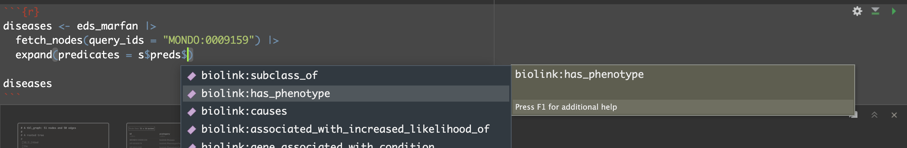

```{r, include=FALSE, message=FALSE}
options(width = 300)
knitr::opts_chunk$set(eval = TRUE, echo = TRUE, fig.width = 10, message = FALSE, warning = FALSE)
```

Knowledge Graphs (KGs) may contain large amounts of information; the Monarch Initiative KG for example
contains not only millions of nodes and edges, but each node may belong to one or more *categories*, across
dozens of available categories. While edges may only have a single *predicate* linking a subject and object
node, there are similarly dozens of available predicates. Each node category and edge predicate may further
come with other node or edge properties, and these may be shared across some but not all node categories or
edge predicates.

To help navigate this extensive information, `monarchr` provides two functions that may be applied to KG 
engines: a `summary()` function that counts these categories and predicates across nodes and edges, and
an `example_graph()` function that returns a (non-random) subgraph gauranteed to represent every node
category and edge predicate.

As usual, we being by loading the `monarchr` package, along with `tidygraph` and `dplyr` which tend to be useful
(but we will not actually use in this vignette).

```{r}
library(monarchr)
library(tidygraph)
library(dplyr)
```


# Engine `summary()`

The summary function, when applied to a KG engine (like `file_engine()`, `neo4j_engine()`, 
or the cloud-hosted `monarch_engine()`), prints counts of nodes and edges broken out by
available node category and edge predicate. To keep the information small, we'll produce a summary
of the included mini-KG containing information about Ehlers-Danlos Syndrome (EDS) and Marfan Syndrome:

```{r}
filename <- system.file("extdata", "eds_marfan_kg.tar.gz", package = "monarchr")
eds_marfan <- file_engine(filename)

summary(eds_marfan)
```

The printout reports the number of nodes for each category, and the number of edges for each predicate.

This information is also returned (invisibly) as a list; to suppress the printed output we can add `quiet = TRUE`.

```{r}
s <- summary(eds_marfan, quiet = TRUE)

paste("Total nodes:", s$total_nodes)
paste("Total edges:", s$total_edges)

head(s$node_summary)
head(s$edge_summary)
```

Finally, the returned list also includes `cats` and `pred` entries, which are 
named lists containing all available category and predicate labels for 
convenient auto-completion in your favorite IDE.

<br /><br />



<br /><br />

The resulting auto-completion inserts the appropriate backtics in RStudio. 

```{r}
diseases <- eds_marfan |>
  fetch_nodes(query_ids = "MONDO:0009159") |>
  expand(predicates = s$preds$`biolink:has_phenotype`)

diseases
```


# Engine `example_graph()`

Fetching a sample of data from a KG is another convenient way to explore its 
contents, but a random sample is unlikely to illustrate the diversity of available
node categories, edge predicates, and information associated with nodes and 
edges of different types. 

To serve this need `monarchr` provides an `example_graph()` function, which 
fetches a sample of nodes and edges that are guaranteed to represent every
available category and every available predicate. When using this method,
it is important to remember that nodes frequently belong to multiple categories, 
and the `pcategory` ("primary category") column represents one of a set of 
chosen categories to represent the node. The choice of category shown in `pcategory`
is defined by `monarchr`, not the KG itself, and is configurable.

```{r}
ex_g <- eds_marfan |> example_graph()
ex_g
```

Note that this method makes no other guarantees: the sample is not random,
the resulting graph may not be connected, the result is not the smallest possible
graph that contains all categories and predicates, and nodes and edges may not
contain complete data for all possible properties for their respective types. 
Still, browsing the resulting graph in tabular form as above can quickly reveal 
the bulk of information available in a KG for further targeted exploration
with `fetch_nodes()` and `expand()`.


