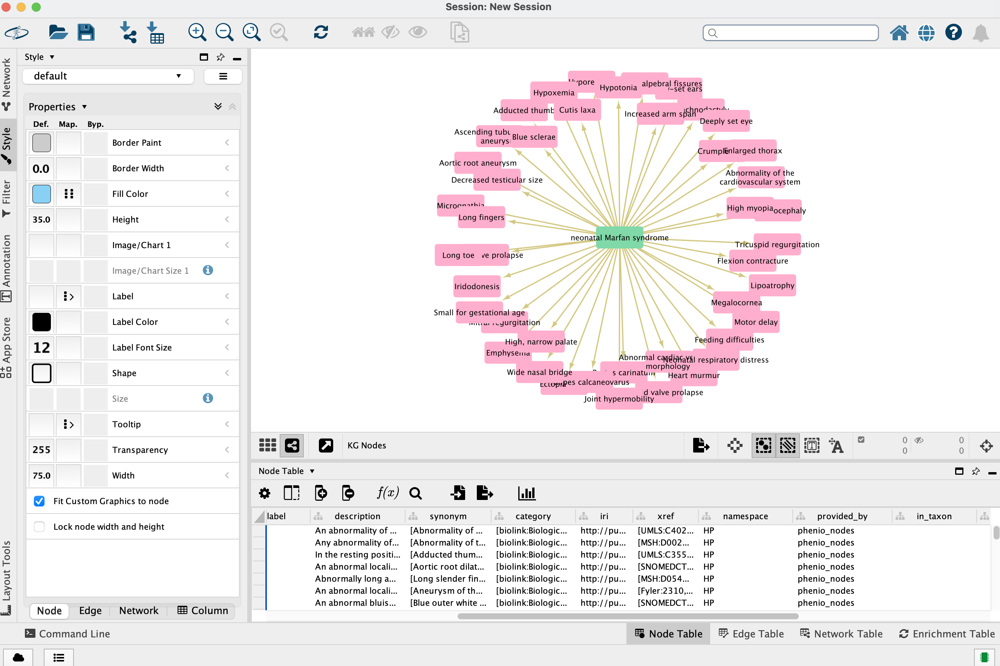

```{r, include=FALSE, message=FALSE}
options(width = 300)
knitr::opts_chunk$set(eval = TRUE, echo = TRUE, fig.width = 10, message = FALSE, warning = FALSE)
```

`monarchr` supports a large number of plotting frameworks compatible with `tidygraph` and `igraph`, including [`ggraph`](https://ggraph.data-imaginist.com/), [`visNetwork`](https://datastorm-open.github.io/visNetwork/),
and [`threejs`](https://bwlewis.github.io/rthreejs/). Included are a basic `plot()` for
knowledge graphs via `ggraph`, and a `cytoscape()` function to export a graph to a running [Cytoscape](https://cytoscape.org/) instance via [`RCy3`](https://www.bioconductor.org/packages/release/bioc/html/RCy3.html).

As usual, we begin by loading the `monarchr` package, along with `tidygraph` and `dplyr` which tend to be useful.

```{r}
library(monarchr)
library(tidygraph)
library(dplyr)
```


# Basic `plot()`

The basic `plot()` function is a wrapper around `ggraph`. By default, 
node color tracks `pcategory` and edge color `predicate`, though these
can be changed with the `node_color` and `edge_color` properties. 

While `node_shape` and `edge_linetype` can also be changed, 
they default to `namespace` (commonly indicating the node's data source) and 
`primary_knowledge_source` (commonly indicating the edge's data source). 
Here we see that these nodes are part of [`MONDO`](https://mondo.monarchinitiative.org/) 
and [`HGNC`](https://www.genenames.org/), and the relationships between them
are sourced from MONDO as well as [OMIM](https://omim.org/) and 
[Orphanet](https://www.orpha.net/).


```{r}
data(eds_marfan_kg)

g <- eds_marfan_kg |>
  fetch_nodes(query_ids = c("MONDO:0017310")) |>
  expand(predicates = "biolink:subclass_of", direction = "in", transitive = TRUE) |>
  expand(categories = "biolink:Gene")

plot(g)
```
In this example we first fetch Neonatal Marfan Syndrome, Brittle Cornea Syndrome, and 
their direct phenotypes. We then take the join of these two graphs, compute
the degree of each node and filter to only those nodes with `degree > 2`, indicating
only phenotypes connected with both. For plotting, we use `edge_color` set to 
`frequency_qualifier`, but we recode those by their interpretation. The `edge_color`
and `node_color` parameters simply pass their unquoted arguments to `geom_node_point`
and `geom_edge_fan` `ggraph` layers.

```{r}
mar_phenos <- eds_marfan_kg |> 
  fetch_nodes(query_ids = c("MONDO:0017309")) |>
  expand(categories = "biolink:PhenotypicFeature") 

bcs_phenos <- eds_marfan_kg |> 
  fetch_nodes(query_ids = c("MONDO:0009242")) |>
  expand(categories = "biolink:PhenotypicFeature")

both <- kg_join(mar_phenos, bcs_phenos) 

shared <- both |>
  activate(nodes) |>
  mutate(degree = igraph::degree(both)) |>
  filter(degree > 1) |>
  activate(edges) |>
  mutate(frequency_qualifier = factor(frequency_qualifier, 
                                      levels = c("HP:0040281", "HP:0040282", "HP:0040283"),
                                      labels = c("very_frequent", "frequent", "occasional")))

plot(shared, edge_color = frequency_qualifier)
```

Tidygraph [utilities](https://tidygraph.data-imaginist.com/) support easy 
modification of node and edge tables, 
breadth- and depth-first maps, and other graph-centric methods, all of which
may be visualized in creative ways.

# Exporting with `cytoscape()`

Local knowledge graphs can also be visualized with [Cytoscape](https://cytoscape.org/),
which must be running on the same machine as `monarchr`.

```{r eval=FALSE}
cytoscape(mar_phenos)
```
Node color is mapped to `pcategory` and edge color to `predicate`; hoverover
node text is `description` if available, edge hoverover `predicate`. All of these
and many more properties can be customized in Cytoscape.

<center>{width=90%}</center>

