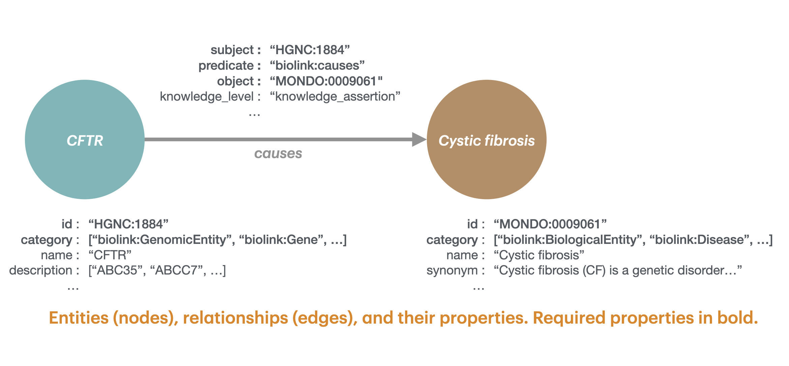

```{r setup, include=FALSE, message=FALSE}
library(dplyr)
library(tidygraph)
library(monarchr)

options(width = 300)
knitr::opts_chunk$set(echo = TRUE)

`%+%` <- function(a, b) {
	paste0(a, b)
}

wrap <- function(labels, size = 20) {
	wrapped <- labels %>% lapply(strwrap, size)
	reformatted <- wrapped %>% lapply(paste, collapse = "\n")
	return(as.character(reformatted))
}

knitr::opts_chunk$set(eval = FALSE)
```


# Background: Biomedical Knowledge Graphs

Knowledge graphs represent entities (such as genes, diseases, or phenotypes) and
the relationships between them; for example that the `CFTR` gene `causes` the disease
`Cystic fibrosis`. In the [Monarch Initiative](https://monarchiniative.org), this
information is stored in a *labeled property graph*, with properties
attached to the entities (nodes) and relationships (edges). The [KGX format](https://github.com/biolink/kgx/blob/master/specification/kgx-format.md) specifies a 
minimal set of properties for knowledge graphs: nodes must have `id` and
`category` properties (where `category` actually stores a multi-valued set of categories), and edges must 
have `subject`, `predicate`, and `object` properties
indicating the source, relationship, and destination of the edge. Both nodes and edges may have
other properties as well, and these can also be multi-valued (lists of strings, integers, etc.)

<center>{width=90%}</center>

The `monarchr` package uses `tidygraph` to represent this information, which stores node and edge
information in tables. List columns are used for multi-valued properties. The following query reveals that `CFTR` causes two diseases, *cystic fibrosis* (`MONDO:0009061`), and *congenital bilateral aplasia of vas deferens from CFTR mutation* (`MONDO:0010178`):

```{r welcome, eval=TRUE, echo=TRUE}
monarch_engine() |>
  get_nodes(query_ids = c("HGNC:1884")) |>
  expand(predicates = "biolink:causes")
```

As this example hints, `monarchr` supports different query "engines", fetching nodes by specified criteria, and expanding 
on fetched subgraphs by following specified relationship criteria. 
Because `monarchr` utilizes [`tidygraph`](https://tidygraph.data-imaginist.com/) which is built on on [`igraph`](https://r.igraph.org/), it is supported by a broad ecosystem, including [packages](https://ggraph.data-imaginist.com/) for [visualization](https://datastorm-open.github.io/visNetwork/), [exploratory analyses](https://r-ega.net/), graph [manipulation](https://tidygraph.data-imaginist.com/reference/index.html) and [algorithms](https://r.igraph.org/reference/index.html),  [matching](https://cran.r-project.org/web/packages/iGraphMatch/vignettes/iGraphMatch.html), and [graph neural networks](https://rpubs.com/giancarlo_vercellino/spinner).


# Engines

Two kinds of engines are supported, providing largely the same functionality: one supporting access to [Neo4j graph databases](https://neo4j.com/), and another supporting file-based access to TSV-formatted `.tar.gz` KGs hosted at [kghub.io](https://kghub.io). Regardless of source, KGs must conform to the [KGX specification](https://github.com/biolink/kgx/blob/master/specification/kgx-format.md).

The most accessible engine provided by `monarchr` is the `monarch_engine()`, designed to access the cloud-hosted [Monarch Initiative](https://monarchiniatiative.org) KG, with additional features such as Monarch's API-hosted search functionality.

```{r monarch_engine, eval=TRUE, echo=TRUE}
g <- monarch_engine() |>
	search_nodes("cystic fibrosis", limit = 5)

g
```

Using another Neo4j database is as simple as specifying a Neo4j [Bolt](https://neo4j.com/docs/operations-manual/current/configuration/ports/) endpoint, and username and password if required. This may be used to host your own Neo4j database for efficient KG access, based on the Monarch Neo4j [docker deployment](https://github.com/monarch-initiative/monarch-neo4j). When using generic Neo4j endpoints, `search_nodes()` falls back to regex-based search of a subset of node properties (see Engine Preferences below).

```{r neo4j_engine, eval=FALSE, echo=TRUE}
# not run:
g <- neo4j_engine("http://localhost:7687", username = "user", password = "pass") |>
	search_nodes("cystic fibrosis", limit = 5)

g
```


Finally, the `file_engine()` provides KG access to KGX-formatted, `.tar.gz` files containing tab-separated `*_nodes.tsv` and `*_edges.tsv` files. The package comes bundled with a version of the MONDO ontology KG for demonstration purposes. You can also provide a local file path, or a URL to a remote file, which will be downloaded to the current working directory. 

```{r file_engine, eval=TRUE, echo=TRUE}
filename <- system.file("extdata", "mondo_kgx_tsv.tar.gz", package = "monarchr")
# filename <- "https://kghub.io/kg-obo/mondo/2024-03-04/mondo_kgx_tsv.tar.gz"

print(filename)
	
g <- file_engine(filename) |>
	search_nodes("cystic fibrosis", limit = 5)

g
```

As with `neo4j_engine()`, the `search_nodes()` function uses a regex-based search against specific node properties, configurable via engine "preferences."

## Engine Preferences

Knowledge graphs provide a very broad range of information. Both nodes and edges have many properties--for cystic fibrosis these include `name`, `description`, `provided_by`, and `in_taxon_label`, to name a few. Some of those properties take multiple values, including the important `category` property for nodes--for cystic fibrosis this property includes `biolink:BiologicalEntity`, `biolink:Disease`, `biolink:Entity`, `biolink:NamedThing`, and `biolink:ThingWithTaxon`, again to name just a few.

With so much information available, it can be helpful to prioritize the most immediately relevant. This is handled in `monarchr` by engines, which are created with a set of *preferences* to specify how graph data are represented. The set of defaults can be reviewed via an engine's `preferences`:

```{r file_engine_default_prefs, eval=TRUE, echo=TRUE}
filename <- system.file("extdata", "mondo_kgx_tsv.tar.gz", package = "monarchr")

e <- file_engine(filename)

e$preferences
```
These preferences affect the following behavior:

- `category_priority`: a vector of node `category` values to prioritize when determining the `pcategory` (primary category) column. If any category values in the node match one of these, the first preferences-specified one is used, otherwise the first category listed for the node is used.
- `node_search_properties`: a vector of node properties to search when using `search_nodes()`. Does not apply to `monarch_engine()` which uses the Monarch keyword search API.
- `node_property_priority`: specifies which node property columns should be listed first when printing.
- 'edge_property_priority': specifies which edgeproperty columns should be listed first when printing.

These can be overridden when creating an engine; in this example, we specify for a `file_engine()` that `search_nodes()` should only apply to the `name` property:

```{r file_engine, eval=TRUE, echo=TRUE}
filename <- system.file("extdata", "mondo_kgx_tsv.tar.gz", package = "monarchr")
g <- file_engine(filename,
								 preferences = list(node_search_properties = c("name"))) |>
	search_nodes("cystic fibrosis", limit = 5)

g
```

# Searching and Getting Nodes

As mentioned above, `search_nodes()` uses the Monarch search API when used with a `monarch_engine()`, but a regex-based field search when using a file-based or generic Neo4j engine. In these latter cases, the search term is expanded as `.*<search term>.*` to match within longer text, and allows the inclusion of regular expression syntax, e.g. `(cystic fibrosis)|(CFTR)`. For all engines, `search_nodes()` provides a `category` parameter to limit the matching nodes to those with one of the specified categories, and a `limit` parameter to limit the number of resulting nodes.

```{r search_fancy, eval=TRUE, echo=TRUE}
g <- monarch_engine() |>
	search_nodes("cystic fibrosis", category = c("biolink:Gene", "biolink:PhenotypicFeature"), limit = 50)

g
```


<!-- MonarchR is designed to support user-friendly queries against Knowledge Graphs -->
<!-- (KGs), specifically the cloud-hosted [Monarch Initiative](https://monarchinitiative.org) KG, -->
<!-- or other [KGX formatted](https://github.com/biolink/kgx/blob/master/specification/kgx-format.md) KGs available at [kghub.org](https://kghub.org). -->

<!-- To support these different data sources, large knowledge graphs are represented -->
<!-- as *engines*. The easiest engine to use is the `monarch_engine()`, which we -->
<!-- can use to get nodes  -->


<!-- It is in early development and testing, and relies upon publicly-available services managed by the Monarch Initiative. -->

<!-- Briefly, a graph stored in a local variable represents a subsets of nodes and/or edges from the larger KG. These local graphs are also [`tidygraph`](https://tidygraph.data-imaginist.com/) objects (which are [igraph](https://r.igraph.org/)s) providing a large range of graph-related functionality. -->

<!-- First, let's load some useful libraries: -->

<!-- ```{r library, message=FALSE} -->
<!-- library(monarchr) -->
<!-- library(dplyr) -->
<!-- library(tidygraph) -->
<!-- #library(kableExtra) # for kbl() table output formatting -->
<!-- #library(ggraph) -->
<!-- #library(ggiraph) -->
<!-- ``` -->

<!-- ### Searching by ID or Keyword -->

<!-- The `query_ids()` function returns matching nodes, while `monarch_search()` function uses the keyword search [API](https://api-v3.monarchinitiative.org/v3/docs), returning up to `limit` nodes. Neither function returns any edges that might exist between those nodes. -->

<!-- ```{r search} -->
<!-- # id lookup -->
<!-- eds_hits <- query_ids(c("MONDO:0007525", "MONDO:0020066", "MONDO:0034021")) -->
<!-- # or search -->
<!-- eds_hits <- monarch_search("Ehlers-danlos syndrome", limit = 3) -->


<!-- nodes(eds_hits) -->
<!-- edges(eds_hits) -->
<!-- ``` -->

<!-- ### Easily manipulate node or edge data -->

<!-- Tidygraphs are stored as node and edge dataframes; we can "activate" one or the other to manipulate it, or extract it with `as_tibble()`. Let's add a `source` to these nodes of `"search"`, and print the node table. -->

<!-- ```{r manipulate} -->
<!-- eds_hits <- eds_hits %>% -->
<!-- 	activate(nodes) %>% -->
<!-- 	mutate(source = "search") %>% -->
<!-- 	select(id, source, everything()) # move new source col to 2nd position -->

<!-- nodes(eds_hits) -->
<!-- ``` -->

<!-- ### PCategory -->

<!-- The `pcategory` column is a unique addition of MonarchR: typically, nodes are annotated with multiple categories, which is stored in the `category` field in the KG. These tend to relate to ontological concepts, in that a `biolink:Disease` is also a `biolink:BiologicalEntity` and `biolink:NamedThing`. Typically, one of these is most of interest in application. Rather than try and determine this "primary" category of interest from the data, we set a priority list of categories to use, choosing the first available prioritized category, or the first category available as a fallback. This can be configured via the `kg_prefs` option should you so choose: -->

<!-- ```{r pcategory} -->
<!-- options("kg_prefs") -->
<!-- ``` -->

<!-- ### Neighborhood Summarization -->

<!-- Let's see what kinds of connections exist in the broader graph for these nodes, which is a good idea before we go and fetch some of them. We can summarize the nodes in the surrounding neighborhood, or the edges: -->

<!-- ```{r neighborhood} -->
<!-- library(knitr) -->
<!-- summarize_neighborhood(eds_hits, summarize = "nodes") -->
<!-- summarize_neighborhood(eds_hits, summarize = "edges") -->
<!-- ``` -->

<!-- Looking at the neighborhood node summary, there are quite a few phenotypes connected to these diseases, 30 other diseases, and 3 genes. -->

<!-- To see what kinds types of relationships these are, we can look at the neighborhood edge summary, which breaks down the set of edges connected to these nodes in a more complex way. Each row represents a set of connections from *query* nodes in our graph `g`, to *result* nodes in the surrounding neighborhood, broken out by the category of the query and result nodes. Note that predicate may be either direction here: result genes -cause-\> our query diseases, but our query diseases -have-\> result phenotypes. Finally, for accuracy the grouping is actually the full category list and the `pcategory` is defined from those, but in practice `pcategory` is a good descriptor. -->

<!-- ### Fetching edges -->

<!-- In this example we can see that there are two links from our diseases (potentially from the same one) to genes via `biolink:gene_associated_with_disease`, and one connected to a gene via `biolink:causes`. There are also two kinds of connections to Phenotypes: `biolink:has_phenotype` and `biolink:has_mode_of_inheritance`. Let's fetch the connections to genes: -->

<!-- ```{r fetch-edges} -->
<!-- eds_with_genes <- eds_hits |> -->
<!-- 	fetch_edges(result_categories = "biolink:Gene") -->

<!-- eds_with_genes -->
<!-- ``` -->

<!-- Notice that our `source` column is still there: we added it as a custom column to the `nodes` data earlier, but now new nodes have been been filled with `NA` values. We can fix this up as we pull in the data. This ability to easily modify, filter and otherwise manipulate the graph data via tabular primitives is a powerful feature of `tidygraph`, this [blog post](https://www.data-imaginist.com/posts/2017-07-07-introducing-tidygraph/) is a good introduction to more. -->

<!-- ```{r fetch-deges-2} -->
<!-- eds_with_genes <- eds_hits |> -->
<!-- 	fetch_edges(result_categories = "biolink:Gene") |> -->
<!-- 	activate(nodes) |> -->
<!-- 	mutate(source = replace_na(source, "genelinks")) -->

<!-- eds_with_genes -->
<!-- # summarize the outgoing edges connected to the graph so far -->
<!-- # summarize_neighborhood(eds_with_genes, direction = "out", summarize = "edges") -->
<!-- ``` -->

<!-- The `fetch_edges` function allows us to narrow which edges to fetch by specifying the directionality, as well as sets of predicates and result (neighborhood) node categories allowed. We have diseases and connected genes: let's pull in further connections to either Phenotypes or Genes, via outgoing has_phenotype or interacts_with relationships: -->

<!-- ```{r fetch-edges-3} -->
<!-- eds_with_genes_phenos_expanded <- eds_with_genes |> -->
<!-- 	fetch_edges(direction = "out",  -->
<!-- 							predicates = c("biolink:has_phenotype", "biolink:interacts_with"), -->
<!-- 							result_categories = c("biolink:Gene", "biolink:PhenotypicFeature")) -->

<!-- eds_with_genes_phenos_expanded -->
<!-- ``` -->

<!-- ### Visualization -->

<!-- Let's create a quick visualization: -->

<!-- ```{r visualization} -->
<!-- ggraph(eds_with_genes_phenos_expanded, layout = "fr") + -->
<!-- 	geom_edge_link(aes(color = predicate)) + -->
<!-- 	geom_node_point(aes(color = pcategory)) -->
<!-- ``` -->

<!-- ### Graph joins -->

<!-- For our next trick, let's find all the phenotypes connected to genes associated with FA and Cystic Fibrosis. We'll then find the intersection of those phenotypes with an inner join on the nodes. -->

<!-- ```{r graph-joins} -->
<!-- fa <- monarch_search("Fanconi anemia", limit = 1) %>% -->
<!-- 	fetch_edges(result_categories = "biolink:Gene") %>% -->
<!-- 	fetch_edges(direction = "out", predicates = "biolink:has_phenotype") -->

<!-- cf <- monarch_search("Cystic Fibrosis", limit = 1) %>% -->
<!-- 	fetch_edges(result_categories = "biolink:Gene") %>% -->
<!-- 	fetch_edges(direction = "out", predicates = "biolink:has_phenotype") -->

<!-- shared_nodes <- inner_join(nodes(fa), nodes(cf)) -->
<!-- shared_nodes -->
<!-- ``` -->

<!-- Let's see these in context, by doing a full join on our EDS and CF graphs, then keeping only nodes that are either diseases, genes, or one of these shared phenotypes: -->

<!-- ```{r graph-joins-2} -->
<!-- merged <- fa %>% -->
<!-- 	graph_join(cf) %>% -->
<!-- 	activate(nodes) %>% -->
<!-- 	filter(pcategory %in% c("biolink:Gene", "biolink:Disease") | id %in% shared_nodes$id) -->

<!-- ggraph(merged, layout = "fr") + -->
<!-- 	geom_edge_link(aes(color = predicate)) + -->
<!-- 	geom_node_point(aes(color = pcategory)) -->
<!-- ``` -->

<!-- ### Transitivity -->

<!-- The `fetch_edges` function can also be used to fetch edges transitively. For example, if we were to try and look for genes connected to the first hit for Ehlers-Danlos Syndrome, we would find none. However, we can use the `transitive` parameter to find genes connected to diseases that are subclasses of Ehlers-Danlos Syndrome, and then pull in the genes from there. -->

<!-- ```{r transitivity} -->
<!-- eds_with_subtypes <- monarch_search("Ehlers-danlos syndrome", limit = 1) |> -->
<!-- 	fetch_edges(direction = "in", predicates = "biolink:subclass_of", transitive = TRUE) |> -->
<!-- 	fetch_edges(result_categories = "biolink:Gene") -->

<!-- # plot -->
<!-- ggraph(eds_with_subtypes, layout = "sugiyama") + -->
<!-- 	geom_edge_link(aes(color = predicate)) + -->
<!-- 	geom_node_point(aes(color = pcategory)) + -->
<!-- 	coord_flip() -->
<!-- ``` -->

<!-- When using `transitive = TRUE`, each relationship type will traversed separately and the results joined. It's always wise to use `transitive = TRUE` with caution, as it can result in a large number of edges being fetched, and always indicate a direction of `"in"` or `"out"` to avoid fetching the entire KG. -->

<!-- ### Ancestors and Descendants -->

<!-- With some creativity, we do quite quite a lot with these few primitives. For example, from an initial search of 5 hits for EDS, we can visualize all of their ancestors. We can do the same for descendants. Note that these will find edges between the nodes in the search results, as well as intermediate nodes. -->

<!-- ```{r ancestors-descendants} -->
<!-- eds_search <- monarch_search("Ehlers-danlos syndrome", limit = 5) %>% -->
<!-- 	activate(nodes) %>% -->
<!-- 	mutate(source = "search") -->

<!-- eds_search_ancestors <- eds_search |> -->
<!-- 	fetch_edges(direction = "out", predicates = "biolink:subclass_of", transitive = TRUE) %>% -->
<!-- 	activate(nodes) %>% -->
<!-- 	mutate(source = replace_na(source, "ancestors")) -->

<!-- eds_search_descendants <- eds_search |> -->
<!-- 	fetch_edges(direction = "in", predicates = "biolink:subclass_of", transitive = TRUE) %>% -->
<!-- 	activate(nodes) %>% -->
<!-- 	mutate(source = replace_na(source, "descendants")) -->

<!-- ggraph(eds_search_ancestors, layout = "sugiyama") + -->
<!-- 		geom_edge_link(aes(color = predicate)) + -->
<!-- 		geom_node_point(aes(color = source)) + -->
<!-- 		coord_flip() -->

<!-- ggraph(eds_search_descendants, layout = "sugiyama") + -->
<!-- 		geom_edge_link(aes(color = predicate)) + -->
<!-- 		geom_node_point(aes(color = source)) + -->
<!-- 		coord_flip() -->
<!-- ``` -->

<!-- Let's see the full join of this data, and if we take the inner join of the nodes, we should see just how our 5 search results are connected to each other (via intermediary nodes if necessary). -->

<!-- ```{r ancestors-descendants-2} -->
<!-- merged <- eds_search_ancestors |>  -->
<!-- 	graph_join(eds_search_descendants) -->

<!-- ggraph(merged, layout = "sugiyama") + -->
<!-- 		geom_edge_link(aes(color = predicate)) + -->
<!-- 		geom_node_point(aes(color = source)) + -->
<!-- 		coord_flip() -->

<!-- inner <- eds_search_ancestors %>% -->
<!-- 	activate(nodes) %>% -->
<!-- 	inner_join(nodes(eds_search_descendants)) -->

<!-- ggraph(inner, layout = "sugiyama") + -->
<!-- 		geom_edge_link(aes(color = predicate)) + -->
<!-- 		geom_node_point(aes(color = source)) + -->
<!-- 		coord_flip() -->
<!-- ``` -->

<!-- ### Lists of graphs -->

<!-- As a functional language, R provides powerful features for working with lists of data. In this example we begin with a graph with 5 disease nodes of interest; we use `explode()` to split the graph into a list of 5 single-node graphs, then use `lapply()` to work with these in parallel, fetching neighborhoods, extracting the nodes data, and removing the original searched nodes based on the `source` column we added earlier. -->

<!-- ```{r list-of-graphs} -->
<!-- eds_search %>%                                                 # starting with a graph with 5 disease nodes -->
<!-- 	explode() %>%                                                # split into a list of 5 single-node graphs -->
<!-- 	lapply(fetch_edges) %>%                                      # fetch neighborhood edges for each graph  -->
<!-- 	lapply(nodes) %>%                                            # extract nodes df from each graph -->
<!-- 	lapply(function(nodes_df) {filter(nodes_df, is.na(source))}) # remove original searched nodes from each df -->
<!-- ``` -->

<!-- ## Session info -->

<!-- ```{r} -->
<!-- utils::sessionInfo() -->
<!-- ``` -->

